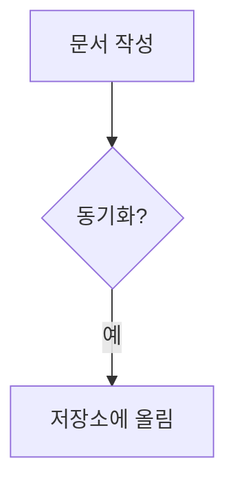

# t-WiKi 사용 설명서

<https://t-wiki.taknim.com>

t-WiKi 는 **내 컴퓨터의 폴더를 그대로 위키로 쓰는** 메모장입니다. 글은 어딘가로 올라가지
않고 내 폴더 안에 평범한 마크다운(`.md`) 파일로 남습니다. 그래서 이 앱을 그만 쓰더라도
글은 그대로 남아 있고, 다른 편집기로도 열 수 있습니다.
원하면 GitHub 저장소와 맞춰 여러 기기에서 같은 글을 볼 수 있습니다.

> 이 문서는 **쓰는 사람을 위한 것**입니다. 어떻게 만들었고 왜 그렇게 했는지, 직접 띄우고
> 배포하는 법은 [README.md](README.md) 에 있습니다.

## 목차

1. [준비물](#준비물)
2. [5분 만에 시작하기](#5분-만에-시작하기)
3. [화면 둘러보기](#화면-둘러보기)
4. [문서 쓰기](#문서-쓰기)
5. [문서끼리 잇기](#문서끼리-잇기)
6. [마크다운 쓰는 법](#마크다운-쓰는-법)
7. [파일 넣기 (첨부)](#파일-넣기-첨부)
8. [그림 다루기](#그림-다루기)
9. [아주 큰 글을 열면](#아주-큰-글을-열면)
10. [찾기와 즐겨찾기](#찾기와-즐겨찾기)
11. [편집을 편하게](#편집을-편하게)
12. [폴더 정돈](#폴더-정돈)
13. [정리하기 (이름·이동·휴지통)](#정리하기-이름이동휴지통)
14. [GitHub 동기화](#github-동기화)
15. [설정 한눈에](#설정-한눈에)
16. [단축키](#단축키)
17. [좁은 화면·핸드폰](#좁은-화면핸드폰)
18. [다른 기기로 옮기기](#다른-기기로-옮기기)
19. [이럴 땐](#이럴-땐)
20. [안전하게 쓰기](#안전하게-쓰기)
21. [알아 둘 제약](#알아-둘-제약)

## 준비물

- **File System Access API 를 지원하는 Chromium 계열의 브라우저**(크롬, 엣지 등)

  핸드폰 브라우저에서는 정상 동작하지 않을 수 있고, 사파리·파이어폭스와 같은 타 브라우저에서는
  동작하지 않습니다.

- **작업에 사용할 폴더** 하나

  원하는 폴더 아무거나 지정해서 쓰시면 됩니다. 빈 폴더도 괜찮고, 이미 폴더나 파일이 들어 있는
  비어 있지 않은 폴더도 괜찮습니다.

- **GitHub 계정과 저장소** (선택 사항)

  필요한 경우 GitHub 을 이용해 여러 기기와 동기화할 수 있습니다. 사용하지 않아도 앱은
  문제없이 쓸 수 있습니다.

설치할 것은 없습니다. 주소만 열면 됩니다.

## 5분 만에 시작하기

1. **폴더 열기** 를 누르고 글을 담을 폴더를 고릅니다. 브라우저가 "이 폴더의 파일을 편집하도록
   허용할까요?" 하고 물으면 허용합니다. 이제 이 폴더가 내 위키가 됩니다.
2. 왼쪽 목록 맨 위 줄(폴더 이름) 오른쪽의 **새 문서**(＋ 문서 모양)를 눌러 문서를 하나 만듭니다.
   이름에 확장자를 안 적으면 마크다운(`.md`)이 됩니다.
3. 오른쪽에 편집기가 열립니다. 글을 칩니다. **0.8초 뒤 저절로 저장**됩니다(제목 옆에 남은
   시간과 💾 단추가 뜹니다). 바로 저장하려면 그 단추나 `⌘S` / `Ctrl+S`.
4. 제목 줄 오른쪽의 **보기 모드**로 *편집 · 나란히 · 미리보기* 를 오갑니다.
5. 다른 문서로 이으려면 본문에 `[[문서 이름]]` 이라고 적습니다.

여기까지면 위키로 쓸 준비는 끝났습니다. 아래는 필요할 때 찾아 읽으면 되는 이야기입니다.

## 화면 둘러보기

| 자리 | 무엇이 있나 |
| --- | --- |
| **머리줄**(맨 위) | 열어 둔 폴더 이름, 시계, **GitHub 동기화**, **단축키**, **⚙ 설정** |
| **옆줄**(왼쪽) | **폴더 / 즐겨찾기** 두 탭, 찾는 칸, 폴더·문서 목록, 맨 아래 **휴지통** |
| **본문**(가운데) | 문서 제목, **저장 상태와 저장 단추**, 보기 모드, 편집기·미리보기 |
| **떠 있는 단추**(본문 오른쪽 아래) | 목차 · 백링크 · 맨 위 · 맨 아래 |
| **정보 표시줄**(맨 아래) | 종류 · 경로 · (편집 중이면) 커서 위치 · 크기 · 수정 시각 |

- 목록의 줄에 손을 얹으면 오른쪽에 단추가 뜹니다 — 폴더는 **새 폴더 · 새 문서 · 파일 추가 ·
  이름 바꾸기 · 옮기기 · 삭제 · 즐겨찾기**, 파일은 그중 뒤의 넷입니다.
- **정보 표시줄의 경로를 누르면 클립보드에 복사**됩니다.
- 옆줄은 오른쪽 위 단추나 `⌘⇧B` 로 접었다 펼 수 있습니다.

## 문서 쓰기

### 만들기

- 맨 위 줄(폴더 이름)의 **새 문서**는 늘 맨 바깥에, 폴더 줄의 **새 문서**는 그 폴더 안에 만듭니다.
- 이름에 확장자를 안 적으면 `.md`, `메모.csv` 처럼 적으면 그 형식으로 만듭니다.
- `⌘⇧D` / `Ctrl+Shift+D` 로도 만들 수 있습니다.

### 저장

손을 멈추면 **기본 0.8초 뒤 저절로 저장**됩니다. 지금 어떤 상태인지는 **제목 옆**을 보면 됩니다.

| 제목 옆 | 뜻 |
| --- | --- |
| `저장됨` (초록) | 고친 것이 모두 파일에 들어갔습니다 |
| 저장 단추 + `3초 뒤 자동 저장` (주황) | 아직 안 들어갔고, 적힌 시간 뒤에 저절로 들어갑니다 |
| 저장 단추 + `변경됨` (주황) | 아직 안 들어갔고, **자동 저장이 꺼져 있습니다** |
| `저장 중…` | 지금 파일에 쓰고 있습니다 |

- 고친 것이 남아 있으면 제목 바로 옆에 **저장 단추**(디스크 모양)가 섭니다. 누르면 기다리지
  않고 바로 씁니다 — `⌘S` 와 같습니다. 자동 저장이 켜져 있어도 나오므로 언제든 누르면 됩니다.
- 눈에 걸려야 하는 것은 단추가 아니라 **아직 안 들어갔다는 말**이라, 그 말에 주황색이 입혀집니다.
- **설정 → 일반 → 자동 저장**에서 기다리는 초를 정하거나(0.1 ~ 60초) 아예 끌 수 있습니다.
- 다른 문서로 옮기면 셈은 **처음부터 다시** 시작합니다.
- 자동 저장을 **꺼 둔 채 다른 문서나 폴더로 옮기려 하면 묻습니다.** *취소* 를 누르고 **저장**
  단추로 저장한 뒤 옮겨 가면 되고, *저장하지 않고 이동* 을 고르면 고친 내용은 사라집니다.
- **파일에 쓰는 동안에는 잠깐 편집이 멈춥니다**(그동안 제목 옆은 `저장 중…` 하나만 남습니다). 그 사이에 친 글자는
  저장 결과에 덮여 사라지기 때문입니다. 보통은 눈 깜짝할 새라 느끼지 못하고, 큰 파일에서만
  잠깐 보입니다. 다 쓰면 커서가 있던 자리에서 그대로 이어 칠 수 있습니다.
- 동기화는 어느 쪽이든 **돌기 전에 편집 중이던 것을 먼저 저장**합니다.
- **같은 파일을 앱 밖(다른 편집기, 동기화 도구)에서 고쳤으면 덮어쓰기 전에 묻습니다.**
  *밖의 내용 다시 읽기* / *내 것으로 덮어쓰기* / *취소* 중에 고릅니다. 취소하면 아무것도
  쓰지 않고 편집을 이어 갑니다.

### 서식 도구

글자를 선택하면 그 자리에 도구 막대가 뜹니다. 마크다운 문법을 외우지 않아도 됩니다.

| 묶음 | 버튼 |
| --- | --- |
| 글자 | 굵게 · 기울임 · 취소선 · 인라인 코드 |
| 제목 | H1 · H2 · H3 |
| 목록 | 글머리 · 번호 · 체크박스 · 인용 |
| 삽입 | 링크 · 위키링크 · 코드 블록 · 수식 |

- 같은 단추를 다시 누르면 서식이 풀립니다.
- 여러 줄을 선택하면 목록·인용·제목은 걸친 줄 전부에 걸립니다.
- 아무것도 선택하지 않고 단축키를 누르면 예시 문구가 들어가고 그 부분이 선택됩니다.

### 보기 모드

*편집 · 나란히 · 미리보기* 세 가지이고 `⌘⇧E` 로 돌립니다. **폴더마다 따로 기억**하므로
미리보기로 보던 중에 새로고침해도 그대로 돌아옵니다.

나란히 볼 때는 가운데 손잡이를 끌어 두 칸의 몫을 바꿉니다(두 번 누르면 반반, 화살표는 2%,
Shift 와 함께는 8%). 잡고 있는 동안 `56% : 44%` 처럼 숫자가 뜹니다.

## 문서끼리 잇기

- **위키링크**: 본문에 `[[다른 문서]]`. 별칭은 `[[회사/휴가 정책|휴가]]`.
  아직 없는 문서는 주황색 점선으로 보이고, 누르면 만들지 물어봅니다.
- **백링크**: 본문 오른쪽 아래 **백링크** 단추를 누르면, 이 문서로 링크를 건 다른 문서들이
  링크가 등장한 줄과 함께 나옵니다. 폴더 경로까지 적히므로 이름이 같은 문서도 구별됩니다.
- **목차**: 제목이 둘 이상이면 **목차** 단추가 섭니다. 펼친 칸은 **화면의 25%(많아야 400px)까지만** 차고,
  짧은 목록은 그 내용만큼만 섭니다. 미리보기에서는 앵커로, 편집 화면에서는
  글자 자리를 짚어 그 줄로 데려다 줍니다.

## 마크다운 쓰는 법

마크다운은 **글자 몇 개로 서식을 주는 글쓰기 방법**입니다. `**굵게**` 처럼 적으면 미리보기에서
**굵게** 보입니다. 외우지 않아도 됩니다 — 글자를 선택하면 뜨는 [서식 도구](#서식-도구)가 대신
넣어 줍니다. 아래는 자주 쓰는 것만 추린 것입니다.

### 기본 문법

**제목**

```markdown
# 큰 제목
## 중간 제목
### 작은 제목
```

`#` 의 개수가 제목의 크기입니다. 제목이 둘 이상이면 [목차](#문서끼리-잇기) 단추가 생깁니다.

**글자 꾸미기**

| 이렇게 적으면 | 이렇게 보입니다 |
| --- | --- |
| `**굵게**` | **굵게** |
| `*기울임*` | *기울임* |
| `~~취소선~~` | ~~취소선~~ |
| `` `코드` `` | `코드` |

**목록**

```markdown
- 첫째
- 둘째
  - 안쪽 목록은 두 칸 들여 씁니다

1. 순서가 있는 목록
2. 번호는 알아서 매겨집니다
```

**할 일 목록**

```markdown
- [ ] 아직 못 한 일
- [x] 끝낸 일
```

**미리보기에서 네모를 눌러 체크할 수 있습니다.** 누르면 글도 함께 바뀌고 저장됩니다.

**링크와 그림**

```markdown
[보이는 글자](https://example.com)

```

**인용**

```markdown
> 인용할 글입니다.
> 여러 줄로 이어 쓸 수 있습니다.
```

**구분선**

```markdown
---
```

**표**

```markdown
| 이름 | 하는 일 |
| --- | --- |
| 첫째 | 설명 |
| 둘째 | 설명 |
```

칸 수만 맞으면 되고, `---` 줄의 길이는 상관없습니다.

**코드**

````markdown
```js
const hello = '안녕'
```
````

언어 이름을 붙이면 **색이 입혀지고** 오른쪽 위에 그 이름이 표시됩니다.

코드 블록 자체를 보여 주고 싶으면 **바깥을 백틱 넷**으로 두르고 그 안에 백틱 셋을 적습니다
(이 설명서도 그렇게 적었습니다).

> **줄바꿈 주의** — 그냥 엔터 한 번은 미리보기에서 줄이 바뀌지 않습니다(마크다운의 원래 규칙).
> 줄을 바꾸려면 **빈 줄을 하나 넣어** 문단을 나누거나, 줄 끝에 **공백 두 칸**을 넣습니다.

### t-WiKi 에서 더 쓸 수 있는 것

**위키링크** — 이 위키의 다른 문서로 잇습니다.

```markdown
[[다른 문서]]
[[회사/휴가 정책|휴가]]
```

`|` 뒤는 화면에 보일 이름입니다. 아직 없는 문서는 주황색 점선으로 보이고, 누르면 만들지
물어봅니다. 링크를 걸면 그 문서 쪽에 [백링크](#문서끼리-잇기)로 남습니다.

**파일 끼워 넣기** — 폴더 안의 그림을 이름만으로 넣습니다.

```markdown
![[그림.png]]
```

**콜아웃** — 눈에 띄는 상자입니다.

```markdown
> [!WARNING] 조심하세요
> 상자 안에 들어갈 내용입니다.
```

제목(`조심하세요`)은 생략해도 종류에 맞는 이름이 붙습니다. 쓸 수 있는 종류:
`note` `info` `tip` `todo` `success` `question` `warning` `danger` `bug` `example` `quote`
(`abstract` `hint` `check` `caution` `error` 같은 다른 이름도 알아듣습니다).

**각주**

```markdown
본문에 표시를 답니다[^1]

[^1]: 설명은 문서 아래쪽에 모입니다.
```

**수식** — 문장 안에 넣을 수도, 한 문단을 통째로 차지하게 할 수도 있습니다.

```markdown
문장 안에 넣으려면 $E = mc^2$ 처럼 달러 기호로 감쌉니다.

문단 하나를 차지하는 식은 달러 둘로 감싸고 줄을 나눕니다.

$$
a^2 + b^2 = c^2
$$
```

값을 적을 때 쓰는 `$5` 같은 것은 수식으로 잡지 않으니 그냥 쓰면 됩니다.

**다이어그램** — ` ```mermaid ` 블록에 적으면 그림으로 그려집니다.

````markdown

````

순서도·시퀀스·클래스·상태·ER·간트·파이 등을 쓸 수 있습니다. 문법이 틀리면 적은 그대로 보이고
무엇이 잘못됐는지 위에 알려 줍니다.

**문서 정보(프론트매터)** — 문서 맨 앞의 `---` 블록은 본문에서 빠지고 제목 아래에 작은 딱지로
보입니다.

```markdown
---
title: 온보딩
tags: [회사, 신입]
---
```

## 파일 넣기 (첨부)

목록의 **파일 추가**(클립 모양)로 마크다운이 아닌 파일도 넣습니다. 폴더를 고르면 나오는
칸에 **끌어다 놓아도** 됩니다. 받는 형식은 정해져 있고, 그 칸 아래 **첨부 가능 파일 목록**
단추를 누르면 펴 볼 수 있습니다.

| 갈래 | 확장자 |
| --- | --- |
| **위키 문서** | `md` — 크기 제한 없이 동기화되고 링크·검색·목차가 모두 됩니다 |
| 이미지 | `png` `jpg` `jpeg` `gif` `webp` `svg` `avif` `bmp` `ico` |
| 문서 | `pdf` `txt` `log` `out` `csv` `tsv` `json` `yaml` `yml` `xml` `html` `htm` `doc` `docx` `xls` `xlsx` `ppt` `pptx` `hwp` `hwpx` |
| 개발 소스 | `sql` `js` `ts` `tsx` `py` `sh` `java` `kt` `go` `rs` `c` `cpp` `cs` `swift` `rb` `php` `css` `scss` `ini` `toml` `diff` `graphql` 등 |
| 압축 | `zip` `rar` `7z` `alz` · 나눠 담은 조각(`.001` `.r01` `.z01` `.a01` …) |

고르면 이렇게 보입니다.

| 형식 | 편집 | 미리보기 |
| --- | --- | --- |
| `csv` `tsv` | 가능 | 표로 그립니다 |
| `json` `yaml` `xml` | 가능 | 색을 입혀 보여 줍니다 |
| 코드 파일 | 가능 | **실행하지 않고 문법 강조만** 합니다 |
| `html` | 가능 | **그리지 않고 문법 강조**로 보여 줍니다. 그려 보려면 브라우저로 그 파일을 여세요 |
| `txt` `log` `out` | 가능 | 편집기만 씁니다 |
| `xlsx` `xls` | — | 표로 그립니다(시트가 여럿이면 탭으로) |
| `docx` | — | 제목·목록·표·굵기와 그림까지 글로 풀어 보여 줍니다 |
| 이미지 | — | 그림으로 봅니다 — [그림 다루기](#그림-다루기)에서 크게 보거나 손질할 수 있습니다 |
| `pdf` | — | 브라우저 PDF 보기 |
| `zip` | — | **풀지 않고 안엣것 목록**을 보여 줍니다 — 이름 · 크기 · 압축 크기 · 압축율 · 최종 수정일시(윈도에서 만든 압축이면 생성일시까지), 목록 아래에 합계. **나눠 담은 조각은 이어서** 읽으므로 어느 조각을 골라도 같은 목록입니다 |
| 한글·일본어 이름 | — | 압축마다 이름을 적어 둔 **글자 꼴이 달라** 깨져 보이곤 합니다. 읽어 보고 가려 내므로 맥에서 만든 것이든 윈도에서 만든 것이든 그대로 보입니다 |
| `rar` `7z` `alz` | — | 파일은 그대로 보관·동기화하지만 **안엣것 목록은 읽지 못합니다**(규격이 공개돼 있지 않거나 목차 자체가 눌려 있습니다). 왜 못 읽는지 화면에 적힙니다 |
| `doc` `ppt` `pptx` `hwp` | — | 열지 못합니다. 파일은 폴더에 그대로 있습니다 |

- 압축은 `zip` `rar` `7z` `alz` 와 **나눠 담은 조각**을 받습니다. 그 가운데 **안엣것을 볼 수
  있는 것은 zip** 뿐입니다. 항목이 아주 많으면 앞 2,000개만 보이고, 4GB 가 넘는 압축(zip64)이나
  조각난 파일은 못 읽는다고 알립니다.
- 조각 번호는 999까지 있어 **파일 고르기 창에는 흔한 번호만**(001~009, r00~r09 …) 걸러 둡니다.
  그 밖의 조각은 **끌어다 놓거나** 폴더에 그대로 두면 들어옵니다.
- **5 MB 를 넘는 첨부는 동기화하지 않습니다.** 목록에는 보이고 미리보기도 되지만 이
  컴퓨터에만 남습니다. 마크다운에는 이 제한이 없습니다.
- 위 표에 없는 형식은 목록에 아예 나타나지 않습니다.

## 그림 다루기

그림은 넣어 두고 보는 것으로 끝나지 않습니다. 크게 들여다보고, 바탕을 바꿔 보고, 옆으로 누운
그림을 바로 세우고, 문서에 넣기 전에 조금 손질하는 일까지 앱 안에서 합니다.

### 뒤에 깔 바탕

흰 로고나 투명한 그림은 바탕에 묻혀 보이지 않습니다. 그림을 고르면 **제목 줄 오른쪽 끝**에
바탕 고르개가 서고, 밝게·가운데·어둡게 중에 고를 수 있습니다. 고른 바탕은 기억해 둡니다.

### 크게·작게 보기

그림 **오른쪽 아래에 뜬 단추**로 배율을 바꿉니다. 위에서부터 **화면 맞춤 · 원본 크기 · 확대 ·
지금 배율 · 축소** 입니다(가운데 숫자는 읽는 자리입니다).

| 글쇠 | 하는 일 |
| --- | --- |
| `+` 또는 `=` | 한 걸음 크게 |
| `-` | 한 걸음 작게 |
| `0` | 화면에 맞추기 |
| `1` | 원본 크기 |
| `Z` | 배율을 숫자로 적어 넣기 |

- 확대·축소는 **지금 보이는 배율에서** 한 걸음씩 옮깁니다. 눈금은 작을수록 촘촘합니다 —
  100% 아래는 **20%** 씩(10 · 20 · 40 · 60 · 80 · 100), 100~200% 는 **25%** 씩,
  200~300% 는 **50%** 씩. 맨 아래는 **10%**, 맨 위는 **300%** 입니다.
- **가운데 배율 숫자를 누르면 직접 적어 넣을 수 있습니다**(`Z` 와 같습니다). 10 ~ 300 사이로
  적고, 그 밖의 값은 가까운 끝으로 맞춰집니다. 110% 처럼 눈금에 없는 값을 쓰거나, 여러 그림을
  같은 배율로 견줄 때 씁니다.
- 줄여서 칸보다 작아지면 가운데에, 키워서 칸을 넘으면 왼쪽 위부터 보이고 굴려서 봅니다.
- 단추 자리는 **반투명**이라 아래 그림이 비칩니다. 지금 보고 있는 배율(화면 맞춤·원본 크기)에
  해당하는 단추는 **켜진 채**로 보입니다.
- **스페이스를 누른 채 끌면** 그림이 따라옵니다(손 모양으로 바뀝니다). 굴림대를 잡지 않아도
  되고, 수정 화면에서도 똑같습니다. 누르고 있는 동안에는 스페이스로 단추가 눌리지 않으니
  자판만 쓸 때는 `Enter` 로 누르세요.
- 다른 파일로 옮기면 다시 **화면 맞춤**에서 시작합니다.
- 오른쪽 위에는 **형식과 크기**(`PNG 300 × 200px`)가 적힙니다.

### 수정하기

그림을 고르고 제목 줄의 **✏ 수정** 을 누르면(또는 `⌘⇧E`) 그 자리에서 수정 화면이 열립니다.
제목 옆이 **수정 모드** 로 바뀌고, 옆줄과 목록은 그대로 보입니다.
화면은 **그림이 칸에 꽉 차는 배율**로 열립니다 — 큰 그림도 한눈에 들어오고, 작은 그림도 크게 키워
놓아 고를 수 있습니다.

| 무엇 | 어떻게 |
| --- | --- |
| **잘라내기** | 그림 위를 **왼쪽 단추로 끌어** 남길 자리를 고릅니다(오른쪽 단추는 브라우저 메뉴). 배율을 키워 놓으면 더 쉽습니다. *선택 영역 해제* 로 취소 |
| **비율 고정** | *자유 · 1:1 · 4:3 · 16:9 · 3:2 · 5:3 · 5:4 · 7:5* 중에 고르면 그 비로만 골라집니다. **긴 쪽**을 *가로·세로* 로 바꾸면 눕거나 섭니다(`16:9` → `9:16`). 이미 골라 둔 자리가 있으면 그 자리도 새 비로 다시 잡힙니다 |
| **크게 보며 고르기** | 배율을 올려 칸보다 커지면 **가로로 굴려** 봅니다. 끌다가 **칸 가장자리에 닿으면 저절로 굴러가** 화면 밖까지 이어서 고를 수 있습니다 |
| **그림 옮겨 보기** | **스페이스를 누른 채 끌면** 손 모양으로 바뀌며 그림이 따라옵니다. 크게 키워 놓고 다른 자리를 보러 갈 때 굴림대를 잡지 않아도 됩니다 |
| **고친 자리 다듬기** | 고르고 나면 네 **변**과 네 **꼭지점**에 손잡이가 섭니다. 변을 끌면 가로·세로 한쪽만, 꼭지점을 끌면 두 쪽이 함께 바뀝니다 |
| **자리 옮기기** | 고른 칸 **안쪽을 끌면** 크기는 그대로 두고 자리만 옮겨집니다 |
| **고르기 그만두기** | 고른 칸 **바깥을 한 번 누르면** 풀립니다(*선택 영역 해제* 와 같습니다) |
| **자리 보기** | 그림 위에서는 **손가락 옆에 숫자가 따라다닙니다** — 누르기 전에는 짚고 있는 자리(`180, 20`), 고르는 중에는 고른 크기(`101 × 81`) |
| **배율** | 수정 화면에서도 **그림 오른쪽 아래에 같은 단추가 떠 있습니다**(화면 맞춤 · 원본 크기 · 확대 · 배율 · 축소). 가운데 숫자를 눌러 적어 넣는 것도, 글쇠(`+ - 0 1 Z`)도 보기와 같습니다 |
| **돌리기·뒤집기** | **↺ ↻** 로 왼쪽·오른쪽으로 90°씩 돌리고, 나머지 둘로 **좌우·상하**를 뒤집습니다. 지금 방향은 단추 **아래 줄**에 적히고, 손댔으면 *되돌리기* 가 서서 한 번에 풉니다 |
| **사이즈(리사이징)** | 너비·높이를 적습니다. *가로세로 비율 지키기* 를 켜 두면 한쪽만 적어도 됩니다. **원본 대비** 줄의 *원래 크기 · 200% · 150% · 50% · 25%* 를 누르면 두 칸이 한 번에 채워집니다(지금 적힌 수가 아니라 **원본 대비**라, 50% 를 두 번 눌러도 절반 그대로입니다) |
| **형식 바꾸기** | PNG ↔ JPG. JPG 는 품질(10 ~ 100%)도 정합니다 |

- **돌리거나 뒤집으면 골라 둔 자리는 풀립니다.** 돌리면 가로와 세로가 바뀌어 그 자리가 뜻을
  잃기 때문입니다. **방향을 먼저 잡고 잘라내기를 하세요.** 화면 맞춤으로 보고 있었다면 돌린
  뒤에도 다시 칸에 맞춰 줍니다.
- 다 골랐으면 **저장**(`⌘S`). 이름은 `사진_modified.png` 로 미리 적혀 있고 고칠 수 있습니다.
- **취소**(`Esc`) 하면 아무것도 만들지 않고 보기로 돌아갑니다.
- **같은 이름이 이미 있으면 덮어쓸지 묻습니다.** 덮으면 **되돌릴 수 없고**, 그 그림을 끼워 넣은
  문서도 함께 바뀝니다. 남겨 두려면 취소를 누르고 다른 이름으로 저장하세요.
- 저장하면 그 파일이 바로 열려 결과를 확인할 수 있습니다. **취소** 하면 아무것도 만들지 않습니다.
- **JPG 에는 투명이 없습니다.** 투명하던 자리는 흰 바탕으로 깔립니다.
- 그림은 컴퓨터 밖으로 나가지 않습니다. 브라우저 안에서 그려 냅니다.

## 아주 큰 글을 열면

**5MB 가 넘거나 4,000줄이 넘는 글자 파일**은 고치는 자리가 아니라 **보는 자리**로 열립니다.
오른쪽 위에 **대용량 파일 모드** 딱지가 반쯤 비친 채로 뜨고, 손을 얹거나 누르면 무엇이
꺼졌는지 알려 줍니다.

| 꺼지는 것 | 비고 |
| --- | --- |
| **고치기** | 보기만 합니다. 고치려면 다른 편집기로 여세요 |
| **미리보기**(표·구문 강조) | 그리지 않습니다 |
| **줄 번호** | 세우지 않습니다 |
| **커서 위치** | 적지 않습니다 |

모두 **글이 커서 느려지는 것을 막으려는 것**입니다.

**글은 자르지 않습니다.** 처음부터 끝까지 그대로 볼 수 있고, 굴리기도 가볍습니다.
그림·PDF·오피스 파일은 크기와 상관없이 하던 대로 열립니다.

## 찾기와 즐겨찾기

### 검색

옆줄 **폴더 탭**의 찾는 칸이 열어 둔 폴더 전체를 훑습니다(`⌘P` 로 바로 갑니다).

| 무엇을 | 어디까지 |
| --- | --- |
| 폴더 | 이름 |
| 마크다운 | 이름과 본문 |
| 텍스트 첨부(`txt` `csv` `json` `yaml` `xml` `html` …) | 이름과 본문 |
| 그림·PDF·오피스 | 이름 |

- 이름이 걸린 쪽이 본문보다 훨씬 앞에 섭니다.
- 텍스트 첨부의 본문은 **검색을 시작할 때** 읽습니다. 읽는 동안 그렇다고 알려 주고, 다 읽으면
  결과가 늘어납니다. 큰 파일은 **앞에서부터 1MB 까지** 읽어 두므로 앞부분은 본문으로도
  찾힙니다(그렇게 찾은 결과에는 `· 앞부분에서` 가 붙습니다). **이름으로 찾는 것은 크기와
  상관없습니다.**

### 즐겨찾기

- 목록 줄 오른쪽 **별 단추**로 담고 뺍니다. 담긴 것은 별이 켜집니다.
- 옆줄 **즐겨찾기 탭**(`⌘⇧2`)에서 봅니다. 끌어서 순서를 바꾸거나 `⇧↑↓` 로 옮깁니다.
- 즐겨찾기 탭의 찾는 칸은 담아 둔 것을 **이름으로만** 거릅니다.
- 즐겨찾기는 열어 둔 폴더 안에 함께 저장되어 **동기화하면 다른 기기에도 따라갑니다.**
  양쪽에서 각각 담았으면 다음 동기화 때 합쳐집니다.

## 편집을 편하게

설정 → **모양 → 편집기** 에서 켜거나, 단축키로 바로 켜고 끕니다. 단축키로 켜고 끄면
무엇이 어떻게 됐는지 알림으로 알려 줍니다(미리보기만 볼 때는 눈에 띄는 변화가 없으므로).

| 기능 | 켜는 법 | 하는 일 |
| --- | --- | --- |
| **줄 번호** | `⌘⇧K` | 편집기 왼쪽에 줄 번호를 세웁니다. 접힌 긴 줄에도 번호는 한 번만 섭니다 |
| **커서 위치** | `⌘⇧Y` | 아래 표시줄에 `행 12 열 5` 로 적습니다 |
| **행·열로 가기** | `⌘⇧L` 또는 그 표시를 클릭 | 갈 행과 열을 칸마다 따로 묻고 그 자리로 데려다 줍니다 |

- 행·열로 가기에서 **열을 비우면 그 줄 첫 칸**으로 갑니다.
- 줄 수를 넘는 행은 마지막 줄로, 줄 길이를 넘는 열은 줄 끝으로 접습니다. 어림잡아 큰 수를
  적어도 됩니다.
- 미리보기만 보는 중에 `⌘⇧L` 을 누르면 "편집 화면에서만 갈 수 있습니다" 라고 알립니다.
- 커서 위치 표시(`행 12 열 5`)를 **누르는 것**과 `⌘⇧L` 은 같은 일입니다. 지금 자리가 창에
  미리 적혀 있으니 고칠 자리만 바꾸면 됩니다.

## 정리하기 (이름·이동·휴지통)

- **이름 바꾸기**: 줄 단추. 확장자를 적지 않으면 원래 확장자가 그대로 붙습니다.
- **옮기기**: 목록에서 **끌어다 놓거나**, 줄 단추의 **옮기기**로 폴더를 골라 옮깁니다.
  어느 쪽이든 *어디서 → 어디로* 를 한 번 묻습니다. 같은 이름이 있으면 덮을지 묻습니다.
- **삭제**: 지우면 **휴지통으로 옮길지, 완전히 지울지** 묻습니다. 물러서면 아무 일도 없습니다.

### 휴지통

- 지운 것은 열어 둔 폴더 안의 숨은 자리에 보관됩니다. 옆줄 맨 아래 **휴지통** 줄에 든 개수가 보입니다.
- 지운 것마다 **원래 폴더와 옮긴 때**, 그리고 **언제까지 남아 있는지**가 나옵니다 —
  저절로 비우기가 꺼져 있으면 `(버린 지 9일)` 처럼 지난 날을, 켜 두었으면 `(21일 뒤 자동 삭제)`
  처럼 남은 날을 적습니다. 날이 지난 것은 `(다음 동기화 때 삭제)` 입니다.
  칸 위 안내에도 며칠 뒤에 비우는지가 함께 적힙니다. **미리보기**를 누르면 무엇이었는지 엿봅니다 —
  글은 앞부분만, 그림은 그림으로, 폴더는 안엣것 목록으로. 고치지는 못합니다. 한 번에 한 줄만
  펴 두고, 엿보는 칸의 **키는 셋 다 같습니다** — 줄을 펼 때마다 목록이 들썩이지 않게 하려는
  것입니다. 그림은 그 칸 안에 **제 비율대로** 앉고, 칸보다 작은 그림은 늘리지 않습니다. **복원**은 원래 자리로 되돌리고(그 자리에
  다른 것이 생겼으면 덮을지 묻습니다), **완전 삭제**와 **휴지통 비우기**는 확인을 받습니다.
- 휴지통에 든 것은 **목록·검색·백링크·동기화 어디에도 나오지 않습니다.** 저장소에 올라가지 않고 이
  컴퓨터에만 있습니다.
- 설정 → 일반 → 휴지통에서 **"옮긴 지 오래된 것은 동기화할 때 저절로 비우기"**(기본 30일)를
  켤 수 있습니다. 기본은 꺼짐입니다.

## GitHub 동기화

열어 둔 폴더를 GitHub 저장소와 맞춥니다. 여러 기기에서 같은 글을 보거나, 백업 삼아 쓸 수 있습니다.
**설정은 폴더마다 따로** 둡니다.

### 1. 액세스 토큰 발급

GitHub → **Settings → Developer settings → Personal access tokens → Fine-grained tokens →
Generate new token**

- **Repository access**: *Only select repositories* 로 위키용 저장소 **하나만** 고릅니다.
- **Repository permissions**: **Contents** 를 **Read and write** 로. 나머지는 건드리지 않습니다.
- **Expiration**: 만료일을 정해 둡니다.

토큰이 새어 나가도 피해가 그 저장소 하나에 갇히도록 범위를 좁히는 것이 핵심입니다.

### 2. 앱에서 연결

1. **설정 → GitHub 동기화** 를 엽니다(머리줄 **GitHub 동기화** 단추도 설정이 비어 있으면
   이 화면을 엽니다).
2. 토큰을 붙여넣고 **확인**. 계정 이름과 쓸 수 있는 저장소 목록이 뜹니다. 확인이 끝나면
   입력란은 사라지고 `**********` 만 남습니다. 바꾸려면 **변경**, 되돌리려면 **취소**.
   토큰이 잘못되면 칸 바로 아래에 알리고 값을 비웁니다.
3. 저장소와 브랜치를 고릅니다. 저장소 안 하위 폴더만 쓰려면 `docs` 처럼 경로를 적습니다.
   빈 저장소나 아직 없는 브랜치를 적어도 첫 동기화 때 만들어집니다.

### 3. 실행

머리줄 **GitHub 동기화** 단추(또는 `⌘⇧G`)를 누르면 곧바로 돕니다.

- 단추 안이 차오르고, 그 아래 진행 창에 **지금 옮기는 파일**이 적힙니다.
- 끝나면 무엇이 오갔는지 알림으로 알려 줍니다. 문제가 있으면 자세한 결과 창이 저절로 열립니다.
- **설정 → GitHub 동기화 → 지난 결과 보기** 에서 최근 100건까지 다시 봅니다. 회차를 누르면
  오간 파일이 펴지고, 경로의 폴더나 파일 이름을 누르면 그리로 갑니다.
- 저장소에 올라간 회차는 **머리줄(동기화 일시가 있는 줄) 오른쪽 끝에 커밋 이름**이 적힙니다.
  누르면 GitHub 의 그 커밋이 새 탭으로 열립니다. 한 회차는 커밋 하나이므로 여기 한 번만 적습니다.

### 자동 동기화

설정 → GitHub 동기화 → 동기화 방식에서 켭니다.

- 간격은 분 단위(기본 10분, 1~1440분). 머리줄에 다음 실행까지 남은 시간이 보입니다.
- 폴더를 열자마자 도는 첫 회차는 없습니다. 바로 맞추려면 단추를 누릅니다.
- **폴더를 읽는 동안에는 돌지 않습니다.** 타자 중이면 손을 뗀 지 2초를 기다렸다가 저장하고
  돕니다(계속 치면 20초까지만).
- 탭을 여러 개 열어도 한 번에 하나만 돕니다.

### 충돌과 삭제

- **충돌 처리 기본값은 *양쪽 다 보존*.** 저장소 쪽을
  `문서 (저장소 사본 2026-08-28 1530).md` 로 남기고 원래 자리에는 내 것을 올립니다.
  무엇도 잃지 않습니다.
- **삭제 전파는 기본으로 꺼져 있습니다.** 켜기 전까지 한쪽에서 지운 것은 다음 동기화 때
  남아 있는 쪽에서 다시 내려옵니다.
- 이름을 바꾸거나 폴더를 옮긴 것은 **지웠다 새로 만든 것이 아니라 옮긴 것으로** 알아봅니다.
- 한 번에 바뀐 것은 저장소에 **한 묶음**으로 올라가고, 설명도 알아서 붙습니다.

## 폴더 정돈

밖에서 가져온 파일에는 군더더기가 따라옵니다. **설정 → 일반 → 폴더 정돈**에서 치웁니다.

| 단추 | 하는 일 |
| --- | --- |
| **자소 분리된 이름 합치기** | 맥이 적은 *자모가 나뉜* 이름을 모아 적습니다. 글자는 그대로이고 적는 방식만 바뀌는데, 이렇게 해 두면 검색에서 **"분명히 있는데 안 찾히는"** 일이 없습니다 |
| **쓸모없는 파일 지우기** | `.DS_Store` · `Thumbs.db` · `desktop.ini` · `__MACOSX` · `._…` 를 지웁니다. 목록에는 안 보이지만 **저장소에는 올라가는** 파일들입니다 |

- 누르면 먼저 훑어 **무엇을 몇 개** 고칠지 보여 줍니다. 바뀔 것은 접지 않고 다 적으며,
  많으면 **목록 칸 안에서 굴려** 전부 볼 수 있습니다(설명은 그 자리에 그대로 남습니다).
  고른 뒤에야 손을 댑니다.
- 모아 적은 이름이 **이미 있으면 건너뜁니다**(덮지 않습니다). 몇 개를 건너뛰었는지 알려 줍니다.
- 살림 파일은 **휴지통을 거치지 않고 바로** 지웁니다. 운영체제가 필요할 때 다시 만듭니다.
- 이름을 합친 뒤에는 **폴더를 다시 읽어** 주세요(옆줄의 새로 고침).

## 설정 한눈에

머리줄 ⚙ 또는 `⌘,`. 왼쪽 메뉴는 묶음과 갈래로 갈라져 있고, 어느 쪽을 눌러도 그 자리로 갑니다.
**닫을 때 보던 갈래를 기억했다가 다음에 그 자리에서 엽니다.** 머리줄을 잡아 끌면 창이 옮겨지고,
뒤 화면을 어둡게 덮지 않으므로 색·글꼴을 고르는 동안 결과가 그대로 보입니다.

| 묶음 | 갈래 | 그 안에 든 것 |
| --- | --- | --- |
| **일반** | 마지막 화면 상태 · 미리보기 · **자동 저장** · 저장할 때 정돈 · 휴지통 · **폴더 정돈** · 설정 주고받기 | 폴더를 다시 열 때 마지막 상태로 되돌릴지, 이미지·오피스를 그릴지, **몇 초 뒤에 저절로 저장할지**, 저절로 비우기 날수, 내보내기·가져오기 |
| **모양** | 테마 · 본문 · 이미지 · 편집기 | 테마와 밝기, 글꼴·크기·줄 간격·너비, 이미지 정렬과 최대 너비, 줄 번호·커서 위치 |
| **GitHub 동기화** | 저장소 연결 · 동기화 방식 · 동기화 실행 · 이 폴더의 설정 | 토큰·저장소·브랜치, 충돌 처리와 자동 동기화, 지난 결과 보기 |

모양 설정은 고르는 즉시 적용됩니다.

## 단축키

머리줄 **단축키** 단추나 `⌘/` 로 목록이 단추 아래에 뜹니다. 맥은 `⌘`, 윈도·리눅스는 `Ctrl` 입니다.

| 어디서 | 키 | 하는 일 |
| --- | --- | --- |
| 어디서나 | `⌘P` | 검색 칸으로 (옆줄이 접혀 있으면 펴서) |
| 어디서나 | `⌘⇧D` | 새 문서 |
| 어디서나 | `⌘⇧E` | 보기 모드 돌리기 (편집 → 나란히 → 미리보기). **그림에서는 수정 모드 여닫기** |
| 어디서나 | `⌘⇧1` / `⌘⇧2` | 옆줄을 폴더 목록 / 즐겨찾기로 |
| 어디서나 | `⌘⇧B` | 옆줄 접기 / 펴기 |
| 어디서나 | `⌘⇧G` | GitHub 동기화 실행 |
| 어디서나 | `⌘⇧L` | 편집기에서 행·열로 가기 |
| 어디서나 | `⌘⇧K` / `⌘⇧Y` | 줄 번호 / 커서 위치 켜고 끄기 |
| 어디서나 | `⌘,` | 설정 열기 |
| 어디서나 | `⌘/` | 이 단축키 목록 |
| 그림 볼 때·고칠 때 | `+` `-` `0` `1` `Z` | 크게 · 작게 · 화면 맞춤 · 원본 크기 · 배율 적어 넣기 |
| 그림 고칠 때 | `⌘S` `Esc` | 저장 · 그만두기 |
| 그림 볼 때·고칠 때 | `Space` | 누른 채 끌어 그림 옮기기 |
| 편집기 안 | `⌘S` `⌘B` `⌘I` `⌘E` `⌘K` `Tab` | 저장 · 굵게 · 기울임 · 인라인 코드 · 링크 · 두 칸 들여쓰기 |
| 창·목록 | `↑↓` `Enter` `←→` | 줄 이동 · 열기 · 폴더 접고 펴기 |
| 창·목록 | `Esc` `⇧↑↓` | 맨 위 창 닫기 · 즐겨찾기 순서 바꾸기 |

새 문서가 `⌘⇧D` 인 것은 **브라우저가 `⌘N`·`⌘⇧N` 을 새 창·시크릿 창으로 먼저 가져가**
페이지까지 오지 않기 때문입니다. 가로채지 않는 브라우저에서는 `⌘N` 도 듣습니다.

**옆줄은 자판만으로 오갈 수 있습니다.** 검색 칸에서 `↓` 를 누르면 결과가, 검색어가 없으면
**지금 열어 둔 줄**이 잡힙니다. `↑↓` 로 오가고 `Enter` 로 엽니다. 폴더는 `→` 로 펴고 `←` 로
접되, 파일이나 접힌 폴더에서 `←` 는 부모 폴더로 올라갑니다.

## 좁은 화면·핸드폰

창이 720px 보다 좁으면 옆줄이 본문 위에 **서랍처럼** 뜹니다.

- 머리줄 왼쪽 끝의 **≡** 로 엽니다. 문서를 고르면 저절로 닫히고, 폴더를 고르면 열린 채 둡니다.
- 나란히 보기는 원문과 결과가 **위아래로** 섭니다. 손잡이도 눕고 자판은 `↑↓` 입니다.
- 손가락으로 끌어다 옮길 수 없으므로, 줄 단추의 **옮기기**로 폴더를 골라 옮깁니다.
- 손을 얹을 수 없는 기기에서는 **고른 줄의 단추가 늘 보입니다.** 안내 말풍선은 손가락에
  가려 도리어 방해가 되므로 띄우지 않습니다.
- 머리줄 단추(동기화·단축키·설정)는 **아이콘만** 남습니다.
- 설정 창의 왼쪽 메뉴는 **감춰집니다.** 본문에 같은 머리가 차례로 서 있으니 굴려서 찾으면 됩니다.

핸드폰에서는 **정상 동작하지 않을 수 있습니다.** 특히 새로고침하거나 다시 들어올 때마다
폴더 권한을 다시 허락해야 하는 일이 잦고(브라우저가 방문마다 묻습니다), 손가락으로 끌어다
옮기는 것도 되지 않습니다. 태블릿이나 데스크톱 모드, 또는 창을 나눠 쓸 때에 맞춘 배치입니다.

## 다른 기기로 옮기기

문서는 GitHub 동기화로 옮기고, **앱의 취향과 저장소 설정**은 설정 파일로 옮깁니다.

1. 지금 기기에서 **설정 → 일반 → 설정 주고받기 → 설정 내보내기**. 저장할 자리를 고르면
   곧바로 파일이 만들어집니다.
2. 토큰도 함께 담으려면 그 항목을 켭니다. **암호를 두 번 받아 잠가서** 적습니다.
3. 새 기기에서 **폴더를 먼저 연 뒤** *설정 가져오기* 로 그 파일을 고릅니다. 토큰이 들어
   있으면 같은 암호를 묻습니다.

- 암호를 잊었으면 **토큰만 빼고** 나머지 설정이 들어옵니다. 토큰은 설정에서 다시 넣으면 됩니다.
  (암호는 어디에도 적히지 않아 되찾을 길이 없습니다. 세 번 틀리면 가져오기를 접습니다.)
- **동기화 기준점은 담기지 않습니다.** 새 기기의 첫 동기화는 내용이 같은 파일은 그냥 넘어가고
  다른 파일만 충돌로 잡습니다.
- **설정 파일을 위키 폴더 안에 저장하지 마세요.** 그 자리에 두면 동기화 대상이 되어 저장소로
  올라갑니다. 그러려고 하면 앱이 한 번 더 묻습니다.

## 이럴 땐

**새로고침했더니 "다시 열기" 화면이 나옵니다**
브라우저는 내 폴더를 다시 열 때 **사람이 한 번 눌러 주기를** 요구합니다. 누르면 지난번 보던
문서까지 그대로 돌아옵니다.

**폴더를 열어 둔 채 새로고침하려니 떠날지 묻습니다**
실수로 나가 보던 자리를 잃지 않도록 일부러 묻습니다. 취소하면 아무 일도 없습니다.

**즐겨찾기가 한쪽 기기에서만 보입니다**
즐겨찾기 목록도 폴더 안에 함께 저장되므로, 아직 동기화되지 않았을 수 있습니다.
양쪽에서 한 번씩 동기화하면 합쳐집니다.

**파일을 넣었는데 목록에 안 보입니다**
받는 형식인지 확인하세요([파일 넣기](#파일-넣기-첨부)). 목록에 없는 형식과 점(`.`)으로
시작하는 파일·폴더는 보여 주지 않습니다.

**백링크 수가 이상합니다 / 링크가 안 걸립니다**
`[[링크]]` 는 코드 블록 안에서는 세지 않습니다. 같은 이름의 문서가 여러 폴더에 있으면
`[[회사/온보딩]]` 처럼 경로를 적어 가리킵니다.

**동기화에 실패한 파일이 있습니다**
회차를 누르면 오간 파일이 펴지는데, **실패한 줄은 까닭이 붉게** 적힙니다. 받아 온 응답
코드가 있으면 글 끝에 `(404 Not Found)` 처럼 함께 붙습니다.

**동기화가 아예 멈췄습니다**
그 회차를 누르면 `오간 것 없이 멈췄습니다.` 뒤에 까닭이 붉게 이어지고, 받아 온 것이
있으면 괄호로 덧붙습니다(응답 코드 · 어떤 요청이었는지 · 요청 번호).
`Failed to fetch` 처럼 답이 아예 오지 않은 때는 인터넷 연결이나 확장 프로그램이
`api.github.com` 요청을 막고 있는지 보세요.

**동기화가 "충돌"이라고 합니다**
마지막으로 맞춘 뒤로 **이쪽과 저쪽이 둘 다** 바뀐 것입니다. 기본 설정이면 저장소 쪽이
`문서 (저장소 사본 …).md` 로 옆에 남으므로 둘을 비교해 손으로 합치면 됩니다.

**한쪽에서 지운 파일이 다시 내려옵니다**
**삭제 전파**가 꺼져 있어서 그렇습니다(기본값). 양쪽에서 지우고 싶으면 설정 → GitHub
동기화 → 동기화 방식에서 켭니다.

**고친 것이 저장됐는지 모르겠습니다**
제목 옆을 봅니다. `저장됨` 이면 파일에 다 들어간 것이고, 💾 단추와 주황색 글씨가 보이면 아직
들어가지 않은 것입니다(`3초 뒤 자동 저장` = 곧 들어감, `변경됨` = 자동 저장이 꺼져 있음).
단추를 누르거나 `⌘S` 로 바로 쓸 수 있습니다.

**휴지통에 뭘 버렸는지 기억이 안 납니다**
그 줄의 **미리보기**를 누르면 무엇이었는지 엿볼 수 있습니다 — 글은 앞부분, 그림은 그림,
폴더는 안엣것 목록. 보고 나서 복원할지 완전히 지울지 정하면 됩니다.

**폴더를 여는 단추가 아예 없습니다**
사파리·파이어폭스처럼 폴더 열기를 지원하지 않는 브라우저입니다. 크롬이나 엣지에서 열어 주세요.
핸드폰 브라우저는 열리더라도 일부 기능이 제대로 돌지 않을 수 있습니다.

**브라우저 기록을 지웠더니 다 사라졌습니다**
폴더를 여는 권한과 토큰, 동기화 기록이 사라진 것이고 **문서 자체는 그대로** 있습니다.
폴더를 다시 열고 토큰을 다시 넣으면 이어서 쓸 수 있습니다.

## 안전하게 쓰기

- **액세스 토큰은 이 브라우저 안에만, 잠가서 보관합니다.** GitHub 말고 다른 곳으로는 보내지
  않습니다. 그래도 **공용 PC 에서는 쓰지 말고**, 다 쓴 뒤에는 GitHub 에서 토큰을 폐기하세요.
- 토큰을 만들 때는 위키용 저장소 **하나만** 고르고 **만료일**을 정해 둡니다.
- 내보낸 설정 파일에 토큰이 들었다면 잠겨 있어도 **메일·채팅으로 주고받지 마세요.**
- **토큰이나 비밀번호가 적힌 파일을 위키 폴더 안에 두지 마세요.** 폴더 안의 것은 동기화로
  저장소에 올라가고, 한 번 올라간 값은 기록에 남아 지워도 되돌리기 어렵습니다.
- 문서에 적은 HTML 은 걸러서 보여 줍니다. 남이 준 문서를 열어도 그 문서가 앱 화면이나
  내 설정을 건드릴 수는 없습니다.

## 알아 둘 제약

- 폴더 열기는 Chromium 계열 브라우저(크롬, 엣지 등)에서만 됩니다. 핸드폰 브라우저에서는
  정상 동작하지 않을 수 있습니다.
- 5 MB 를 넘는 첨부는 동기화되지 않습니다(마크다운은 제한 없음).
- 1 MB 를 넘는 텍스트 파일은 **앞 1MB 까지만** 본문 검색에 듭니다(이름으로는 크기와 상관없이 찾힙니다).
- 지난 동기화 결과는 **이 브라우저에서 돌린 것만** 남습니다. 다른 기기에서 돌린 것은
  *자세히 보기* 를 눌러 GitHub 에서 봅니다.
- 저장소가 아주 크면 목록을 다 받지 못할 수 있습니다. 그때는 하위 폴더를 정해 범위를 좁힙니다.
